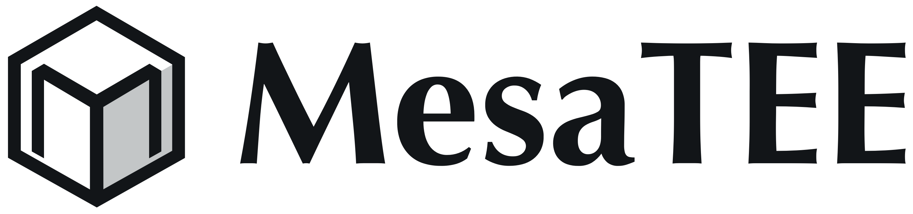
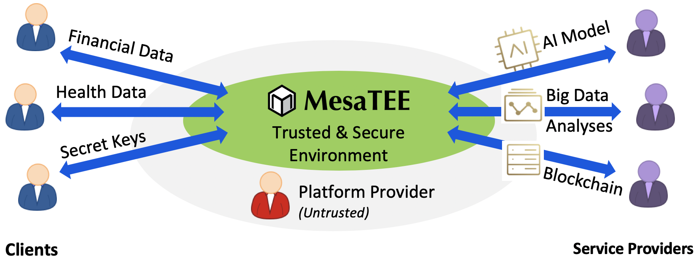

# A Framework for Universal Secure Computing

## Highlights

* MesaTEE is the next-gen solution to enable general computing service for security-critical scenarios. It will allow even the most sensitive data to be securely processed to enable offshore businesses without leakage.

* The solution combines the advanced Hybrid Memory Safety (HMS) model and the power of the Trusted Computing technologies (e.g. TPM) as well as the Confidential Computing technologies (e.g. Intel® SGX).

## What Is MesaTEE?

The emerging technologies of big data analytics, machine learning, cloud/edge
computing, and blockchain are significantly boosting our productivity, but at
the same time they are bringing new confidentiality and integrity concerns. On
**public cloud** and **blockchain**, sensitive data like health and financial
records may be consumed at runtime by untrusted computing processes running on
compromised platforms; during **inhouse data exchange**, confidential
information may cross different clearance boundaries and possibly fall into the
wrong hands; also not to mention the privacy issue arises in **offshore data
supply chains**.

Although the consequences of data breaching have been extensively elaborated,
we should also note that proprietary computing algorithms themselves, such as
AI models, also need to be well protected. Once leaked, attackers can steal the
intellectual properties, or launch whitebox attacks and easily exploit the
weakness of the models.

Facing all these risky scenarios, we are in desperate need of a trusted and
secure mechanism, enabling us to protect both private data and proprietary
computing models during a migratable execution in potentially unsafe
environments, yet preserving functionalities, performance, compatibility, and
flexibility. MesaTEE is targeting to be, as we call it, the full “Universal
Secure Computing” stack, so it can help users resolve these runtime security
risks.

<i>Figure 1: MesaTEE stack redefines future AI and big data analytics by
providing a trusted and secure offshore computing environment. The
confidentiality and integrity of both data and code can be well protected even
  if clients and service/platform providers do not trust each other.</i>

As illustrated in the Figure 1, the confidentiality and privacy of data and
models can be well protected with MesaTEE, even if data and model originate
from different parties with no mutual trust. Moreover, the computing platform
itself is not necessarily trusted either. The Trusted Computing Base (TCB) can
thus be largely reduced to MesaTEE framework alone.

More details can be found in the following documents:
* [Threat Model](docs/threat_model.md)
* [Design](docs/design.md)
* [Hybrid Memory Safety and Non-bypassable Security](docs/hms_and_nbsp.md)
* [Case Studies](docs/case_study.md)

## Getting Started

* [How to Build](docs/how_to_build.md)
* [How to Run](docs/how_to_run.md)
* [FAQs in Build and Run](docs/faq.md)
* [Application Examples](examples/README.md)
* [How to Add A Function](docs/how_to_add_your_function.md)
* [How to Test](tests)
* [Repository Structure](docs/repo_structure.md)
* [Dependencies Vendoring](third_party/README.md)
* [Blogs about MesaTEE](https://medium.com/@baidu.xlab)

## Contributing

The open-source version of MesaTEE is a prototype. The code is constantly
evolving and designed to demonstrate types of functionality.

We still have lots of working-in-progress tasks. We are very happy if you are
interested to submit pull requests. Please refer to
[Issues](https://github.com/mesalock-linux/mesatee/issues) to help out
or report new bugs/suggestions.

Please adhere to the [Rust Development Guideline](docs/rust_guideline.md) and remember to ``make format`` before submitting PRs.

## Sibling Projects

* Rust SGX SDK:
  [https://github.com/baidu/rust-sgx-sdk](https://github.com/baidu/rust-sgx-sdk)
* MesaLock Linux:
  [https://github.com/mesalock-linux/mesalock-distro](https://github.com/mesalock-linux/mesalock-distro)
* MesaLink:
  [https://github.com/mesalock-linux/mesalink](https://github.com/mesalock-linux/mesalink)
* MesaPy:
  [https://github.com/mesalock-linux/mesapy](https://github.com/mesalock-linux/mesapy)

## Contact

We encourage you to discuss open source related matters in [Issues](https://github.com/mesalock-linux/mesatee/issues). For other questions, you may reach out to MesaTEE mailing list: [developers@mesatee.org](mailto:developers@mesatee.org) or each [maintainer](MAINTAINERS.md) individually.
