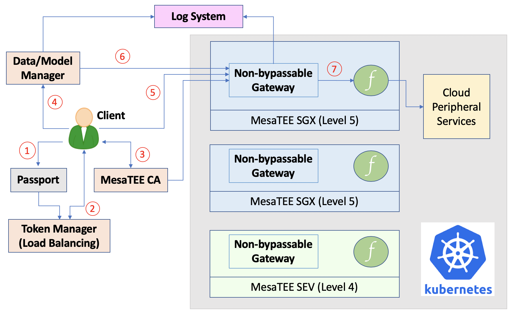
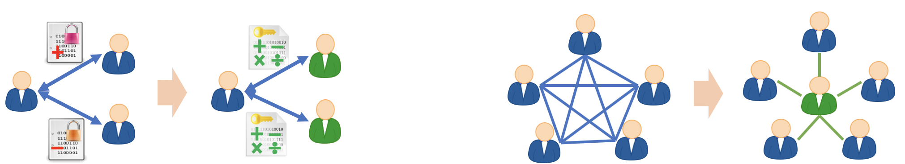
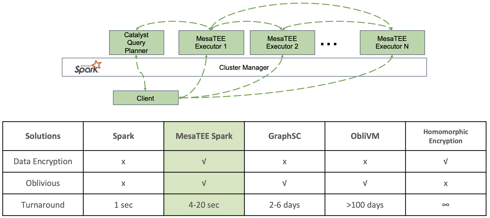
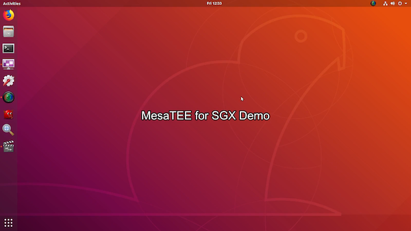

# Case Studies

## Blockchain Applications

### Blockchain Based Privacy-preserving Computing

<i>Figure 1: Universal secure computing over cloud, blockchain, and edge computing</i>

The applications of MesaTEE stack can range from single-instance trusted
computing to large scale distributed networks. In this sense, MesaTEE stack is
the best fit for the computing backends of privacy-preserving blockchains -- as
shown in Figure 1, wherever the data/code flow to, whenever the data/code get
processed, and regardless of the underlying platform, the data/code owner can
always be assured about the confidentiality and integrity protection.

### Trusted Consensus with Extreme Performance

<i>Figure 2: MesaTEE for blockchain services</i>

Figure 2 demonstrates an example blockchain consensus system based on MesaTEE
SGX (Level 5). Not only blockchain, other distributed computing scenarios
requiring consensus or fault-tolerance can also leverage MesaTEE. Specifically,
we utilize Raft over the mutually trusted TLS channels to establish consensus,
and committed logs are written to each local database as the transactions are
appended to the “chain”. In this case, the confidentiality and integrity of the
records on chain are well protected from the platforms, and the remote
attestation during the TLS communications guarantees that the consensus logic
is as honest as expected. The overall blockchain can survive from data lost or
unavailability as long as the majority of the participating nodes are still
healthy (in Figure 2, the blockchain can tolerate one node’s failure).
This is way more efficient and faster than other Proof-of-Work (PoW) based
consensus solutions.

## Sensitive Data Computing over Public Cloud

<i>Figure 3: MesaTEE for public cloud services</i>

Losing data confidentiality and integrity has been a major concern for public
cloud users. MesaTEE can effectively solve this problem by establishing
remotely-attestable trusted secure computing environments.

Figure 3 depicts MesaTEE’s deployment for public cloud services. Multiple TEE
server nodes are grouped together to serve as a cloud cluster, which can be
scheduled by orchestration framework like Kubernetes.

## Secure Multi-party Computation

<i>Figure 4: Traditional SMC compared to MesaTEE based SMC</i>

When cross-department or cross-company data collaboration happens, privacy
concerns arise. Thus secure multi-party computation (SMC) has become more and
more important nowadays to enable joint big data analyses. However, traditional
crypto-based SMC has quite a few limitations, and MesaTEE can solve them
effectively, as shown in Figure 4:

1. once pre-computed for a given collaborative analyses, the confidential
   information can only be utilized by the targeted peers, and it’s difficult
to add dynamic collaborators; however MesaTEE allows trusted and secure
computing upon plaintext, thus does not impose such restriction.
2. once pre-computed for a given computation scheme, the confidential
   information can only perform determined algorithms, without the flexibility
to add arbitrary follow-up computations; again MesaTEE’s trusted and secure
computing upon plaintext does not impose such restriction.
3. once pre-computed for a given computation scheme, the confidential
   information can only be shared/computed by a fix number of participants,
without the flexibility to add or remove participants; MesaTEE’s trusted and
secure computing does not impose such restriction.
4. each of the participating parties needs to exchange information, which
   results in non-negligible latency and throughput downgrading; with MesaTEE,
each data owner only needs to exchange information with the central trusted
node, eliminating unnecessary communications.

<i>Figure 5: MesaTEE’s superior performance on PSI, compared to traditional crypto-based approaches</i>

Figure 5 uses Private Set Intersection (PSI) as the example to demonstrate
MesaTEE’s great advantages over traditional SMC solutions. As a matter of fact,
the more the participants, the larger the dataset to be analyzed, the better
performance MesaTEE will obtain compared to traditional approaches.

## Secure Spark Backend

<i>Figure 6: MesaTEE’s integration as the Spark backend</i>

As shown in Figure 6, we have also used Rust to re-write Spark backend executor
in MesaTEE SGX (Level 5). Distributed big data analyses can thus enjoy strong
confidentiality and integrity guarantees. This is extremely helpful when
analyzing critical privacy dataset. We have also added oblivious protection to
the framework, so that even if the platform owner observes the traffic flowing
between the executors, he/she cannot learn any information from the pattern.

In order to achieve the same security promise, traditional crypto-based
solutions usually cost days or even months to finish the workload that can be
done in one second by the legacy Spark; but MesaTEE can finish execution in
4-20 seconds.

## Secure Key Vault and HSM

Applications and services use cryptographic keys and secrets to help keep
information secure. MesaTEE Key Vault can safeguard these keys and secrets,
similar to hardware security modules (HSMs). 

MesaTEE Key Vault can be conveniently built on [all security levels
2-5](design.md#configurable-security-levels), providing secret management
(securely store and control accesses to tokens, passwords, certificates, API
keys, and other secrets), key management (create and control encryption keys),
and certificate management (provision and manage certificates). 

## Secure AI Computing

<i>Figure 7: MesaTEE’s application in secure AI computing and the performance overhead is acceptable</i>

We have already supported GBDT, Linear Regression, as well as neural networks
in MesaTEE SGX (Level 5). Because we have ported TVM and Anakin in SGX, CNN/RNN
models generated by popular AI frameworks (e.g. Tensorflow, Caffe, etc.) can be
conveniently converted and loaded into SGX. As a result, both the model and the
data can be well protected against the hostile environment. Although our major
focus is on inference, we do support model training within SGX as well.

Performance is critical for AI applications, so we have also done a lot of
optimizations to boost the efficiency, including model compression, model
pipelining, etc. Figure 7 shows the time consumption of running ResNet 50 in
MesaTEE SGX compared to running in the normal world (outside SGX) -- only 20%
overhead is added. With this little addition, no other security solution ever
can provide the same confidentiality and integrity promises.

For more details about MesaTEE trusted secure AI computation, one can take a
look at our demo video:

