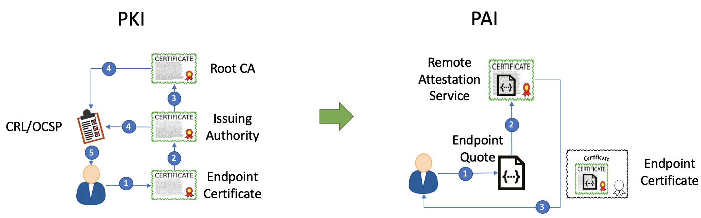
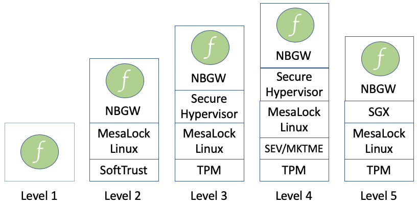

# MesaTEE Design And Roadmap

**Notice:** *MesaTEE is constantly evolving and designed to demonstrate types of functionality, not necessarily 100% matching this design description.*

MesaTEE is the acronym from “Memory Safe (Mesa) Trusted Execution Environment (TEE)”. It favors memory safe programming languages (e.g. Rust) and inherits the design philosophy from TEEs like Intel SGX and ARM TrustZone: isolation and attestable integrity protection. However the full MesaTEE stack has more to offer than a TEE design. Figure 1 demonstrates the high-level layered architecture of our MesaTEE stack.

<i>Figure 1: An overview of the full MesaTEE stack. More details about each block will be covered later.</i>

## Function-as-a-Service Model

Function-as-a-Service (FaaS) computing model allows developers to concentrate on the core event-driven processing logic, without having to worry about the underlying frameworks and infrastructures. This decoupling dramatically shortens the development cycle, makes scaling much easier, and enables more fine-grained execution metering. 

In MesaTEE stack, FaaS is made possible by combining the unified, secure, yet enriched API interface, as well as the carefully tailored secure event service workflow.

## Hybrid Memory Safety

Programs written in memory unsafe languages are prone to memory bugs like buffer overflow, double free, use after free, etc. Formal verification helps to alleviate this problem but the cost is huge -- neither scalable nor sustainable. Rewriting everything in memory safe languages like Rust and Go is promising, but the higher engineering effort can be a tradeoff. 

To provide strong security guarantees using balanced approach, MesaTEE stack is adopting Hybrid Memory Safety: top critical system components like operating system core utils, secure communication libraries (e.g. TLS library), authentication interfaces, etc. are rewritten in Rust and Go; important but less changed C/C++ libraries are formally verified to ensure memory safety; other components not been rewritten/verified are isolated in sandbox container. In general, the overall system must obey the following rules-of-thumb to ensure the safety. 

1. Unsafe components must not taint safe components, especially for public APIs and data structures.
2. Unsafe components should be as small as possible and decoupled from safe components.
3. Unsafe components should be explicitly marked during deployment and ready to upgrade.

## Unified, Secure, Yet Versatile API Interface

As shown in the Figure 1, in order to realize universal secure computing, the MesaTEE stack supports various TEE platforms, including Intel SGX, AMD SEV, ARM TrustZone, etc. To unify the capabilities on these platforms, a pack of TEE low-level libraries are developed. The core of such libraries is the Standard Library (STD), which is independent of the specific TEE platform; other low-level libraries are also provided to enrich the supported functionalities. This layer of libraries is also called the “enabling layer”, where TEE platforms’ capabilities can be largely exposed. However since this layer is close to bare metal, MesaTEE does not guarantee the stability of APIs in this layer. Moreover, because this layer does not differentiate trusted/untrusted APIs by considering whether they cross the TEE boundary, MesaTEE does not encourage developers to directly call APIs in this layer.

Based on this Low-level Libraries layer, a stable Abstraction Layer is provided. This layer also has a strict differentiation for trusted/untrusted APIs -- if developers stick to trusted APIs, the underneath logic can be guaranteed to execute within the TEE boundary, so developers do not have to worry about implicit data leakages. MesaTEE does expose other untrusted APIs for functionality corner cases, however they are well labelled (e.g. open v.s. untrusted_open) to match developers’ intention.

Although the Abstraction Layer APIs are stable and convenient, we also have TEE platform independent APIs (common APIs) and TEE platform dependent APIs (platform specific APIs) available for specific needs. To ease the development, MesaTEE further provides the TEE Foundation Layer, by wrapping up the APIs into turing-complete interpreters. For example, memory safe WASM interpreter is provided to support WebAssembly execution, and memory safe Python interpreter (MesaPy) is also included to support Python script execution. With the help of this Foundation Layer, developers can enjoy the confidentiality and integrity benefits of TEE, while still writing versatile codes with agility.

## Powerful and Open Service Ecosystem

Targeting at redefining AI and big data analytics, MesaTEE stack utilizes the TEE Abstraction and Foundation capabilities to build popular ML algorithms and data processing services. To name a few:

1. KeyStore: secure implementation of key/certificate generation and management in TEE, offering functionalities similar to the Hardware Secure Module (HSM).
2. GBDT: Rust implementation of the Gradient Boosting Decision Trees Algorithm in TEE, with excellent performance comparable to XGBoost. 
3. TVM/Anakin: deep learning framework in TEE, supporting model conversion from most major frameworks like Tensorflow/Caffe/etc. Both model training and inference are supported and performance is close to native.
4. PSI: multi-party private set intersection in TEE, with unbeatable efficiency boost compared to crypto-based solutions like traditional SMC and homomorphic encryption.
5. Spark: Rust implementation of Spark backend in TEE, also with great functionalities and performance.
Meanwhile, MesaTEE stack is totally open. We welcome other developers to join us and carry out more and more built-in services to further extend the ecosystem.

## Trusted Secure Communication Channels

MesaTEE stack also provides secure end-to-end communication channels into the TEE environment. This includes both TEE-to-TEE as well as external-to-TEE communications. Unlike traditional TLS communication channels, MesaTEE secure channels combine certificate based attestation with TEE remote attestation, so that clients are able to not only know which nodes they are talking to, but also ensure the integrity of the remote executing entities. 

<i>Figure 2: Traditional Public Key Infrastructure (left) compared to MesaTEE’s attestation based “PAI” (right)</i>

As shown in Figure 2, in traditional TLS settings, client verifies the endpoint certificate up against to the root certificate authority (Root CA), and validates it according to certificate revocation list (CRL) or through the online certificate status protocol (OCSP). In MesaTEE, client performs remote attestation of the target platform, and finishes trust establishment as well as key exchange at the same time.

## Configurable Security Levels

Different application scenarios may require different security promises; data in processing may also have various clearance levels. To answer for these different levels of situations, MesaTEE stack can be configured to five different security levels, and is able to be further tailored at finer granularity in architecture, as shown in Figure 3.  

<i>Figure 3: Five different security levels of MesaTEE stack</i>

The five security levels are:

1. Unprotected -- the legacy mode without trust and security
2. SoftTEE -- trust is established purely based on software (SoftTrust), the environment is measured by collecting system metrics, keys are protected via whitebox encryption, anti-debugging methods are deployed, and critical components are obfuscated to defend against reverse engineering. Optionally, security can be further enhanced by incorporating MesaLock Linux (Linux distribution with user space core utils written in memory safe languages) and Non-bypassable Gateway (NBGW, a memory safe gateway enforcing authentication, authorization, auditing and accounting). 
3. MesaTEE TPM -- the Trusted Platform Module (TPM) chip is added to enforce secure boot and measure the system boot chain all the way up to the application logic. However TPM measurement can assure only static trustworthy; users can add MesaLock Linux and NBGW to enhance dynamic security. Meanwhile, for multi-tenants situation, payloads can be further isolated with the help of a light-weighted secure hypervisor (e.g. Kata Containers).
4. MesaTEE SEV/MKTME -- the upper layers are the same with the TPM mode except that the physical memory is encrypted automatically by CPU features like AMD SEV or Intel MKTME. This withstands most software-based attacks.
5. MesaTEE SGX -- the ultimate protection, utilizing Intel SGX to isolate and encrypt secrets automatically. It assumes no trust for the operating system and the hypervisor. So in theory even if the attackers compromise everything except the payloads inside SGX, user code and data are still safe. Physical attacks are also defeated in this setting. However recent works have demonstrated that privileged attackers can launch side-channel attacks to probe secrets in the SGX enclaves, so MesaTEE SGX adds TPM and MesaLock LInux to ensure that the exterior operating system is also trusted and secure.
