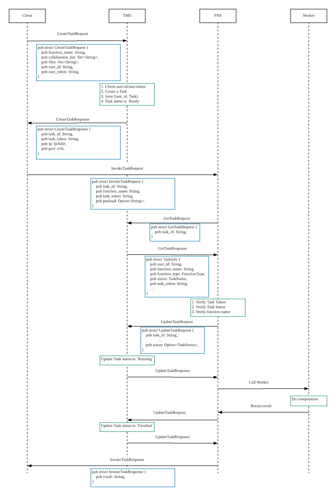
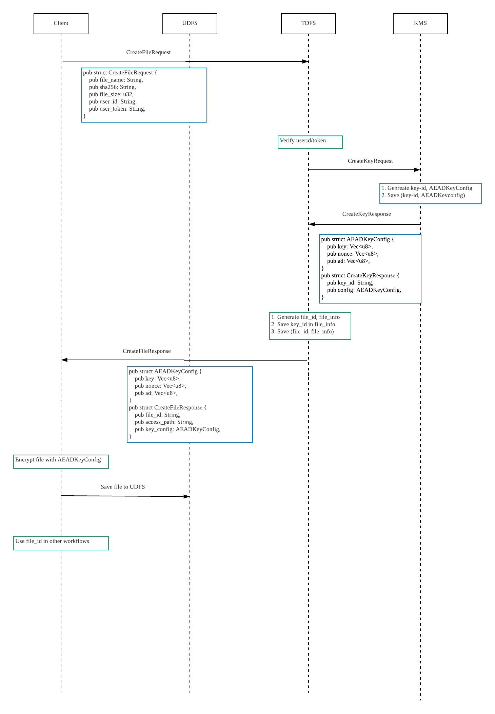
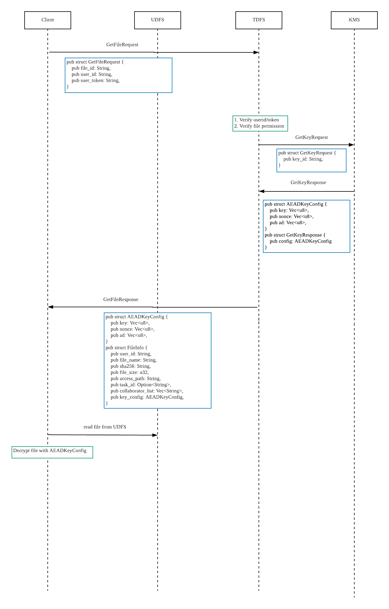
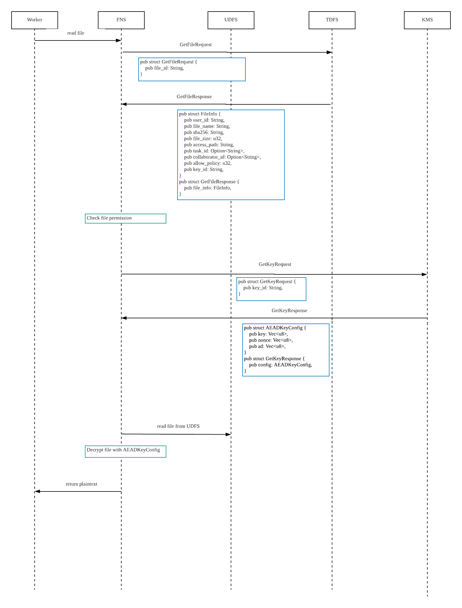
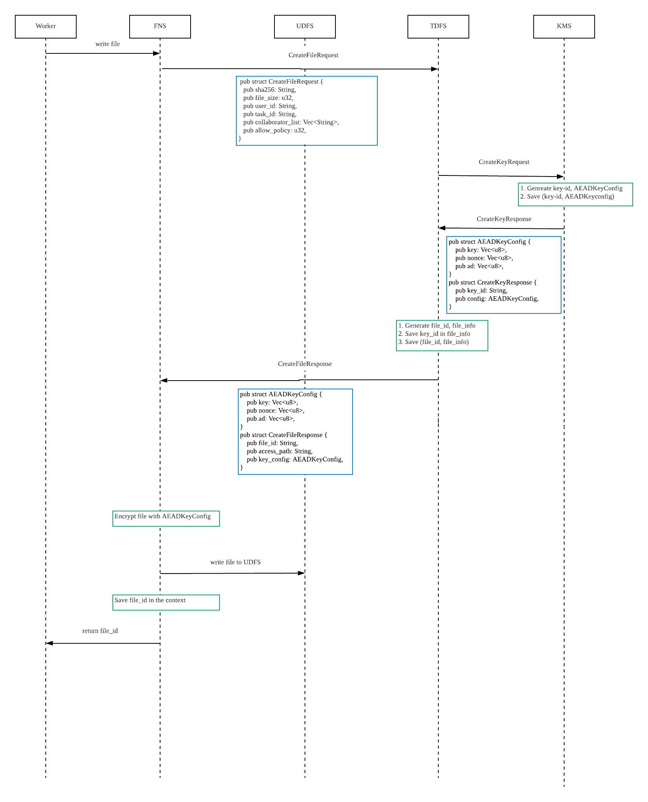

# Basic Task Workflow (Single Party Task without File Reading/Writing)

# Client Write File Workflow

# Client Read File Workflow

# Worker Read File Workflow

# Worker Write File Workflow

# Task With File Reading/Writing Workflow

# Mutliparty Task Workflow

